# School District Analysis with Python

## Overview of Project

### Purpose

The school board noticed evidence of academic dishonesty, specifically with the Thomas High School ninth grade reading and math grades. Our objective is to repeat the school district analysis after we replace the Thomas High School ninth grade reading and math grades with NaN values while keeping the rest of the data the same.

### Resources

- Data Source: [schools_complete.csv](Resources/schools_complete.csv), [students_complete.csv](Resources/students_complete.csv)
- Software: Python 3.7.9, pandas 1.1.3, numpy 1.19.2, jupyter-notebook 6.1.4, Visual Studio Code 1.52.1

## Project Results 

### Procedure

First, we used the `.loc` method on the `student_data_df` to select all the reading scores from the 9th grade at Thomas High School and replaced them with NaN.
`student_data_df.loc[(student_data_df['grade'] == '9th') & (student_data_df['school_name'] == 'Thomas High School'),['reading_score']] = np.nan`

Next, we repeated for the math scores:
`student_data_df.loc[(student_data_df['grade'] == '9th') & (student_data_df['school_name'] == 'Thomas High School'),['math_score']] = np.nan`

Then, we needed to grab the number of 9th grade Thomas High School students:
`thomas_9th_graders = student_data_df.loc[(student_data_df['grade'] == '9th') & (student_data_df['school_name'] == 'Thomas High School')]["Student ID"].count()`. We used this to obtain a new total student count. This allowed us to calculate new math, reading, and overall passing percentages

Afterwards, we began comparing the different high schools utilizing `.groupby(["school_name"])`. We needed to replace the current Thomas High School values because the current DataFrame values were too low due to not being adjusted for the lower student count of only 10th, 11th, and 12th graders. We got our new student count by subtracting the number of 9th graders from the total Thomas High School student population:
`thomas_non_9th_graders = student_data_df.loc[(student_data_df['school_name'] == 'Thomas High School')]["Student ID"].count() - thomas_9th_graders`.

### Analysis

- How is the district summary affected?
  - The tables displayed below show the district summary for the original district analysis (on the top) and the new district analysis (on the bottom). There are very minimal changes to "% Passing Math", "% Passing Reading", and "% Overall Passing" that you would only notice if you round to the thousandth place which we were advised not to in our module.

  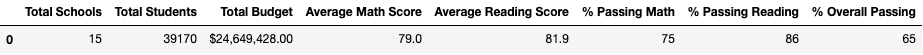
  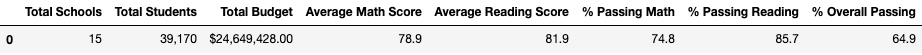

- How is the school summary affected?
  - The tables displayed below show the school summary for the original district analysis (on the left) and the new district analysis (on the right). The only changes on this DataFrame are for the Thomas High School row and they are as follows: a slight decrease in the "Average Math Score", a slight increase in the "Average Reading Score", and miniscule changes to the "% Passing Math", "% Passing Reading", and "% Overall Passing".

  
  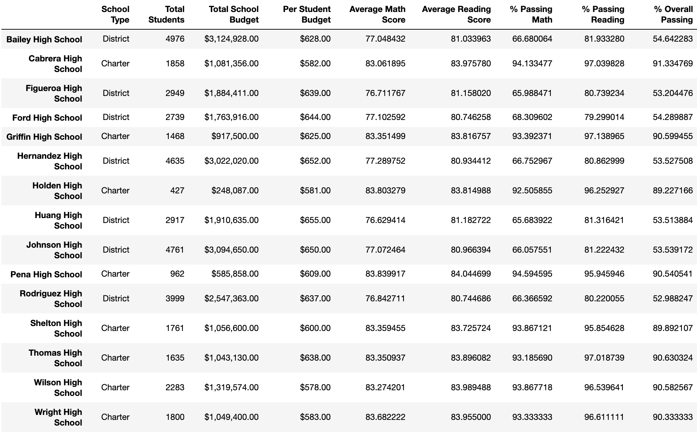

- How does replacing the ninth graders’ math and reading scores affect Thomas High School’s performance relative to the other schools?
  - The tables displayed below show the top 5 schools on the original district analysis (on the left) and the new district analysis (on the right). These tables show us that replacing the Thomas High School 9th grade scores with `nan` did not affect their performance relative to the other schools as they maintained the second highest ranking for "% Overall Passing".

  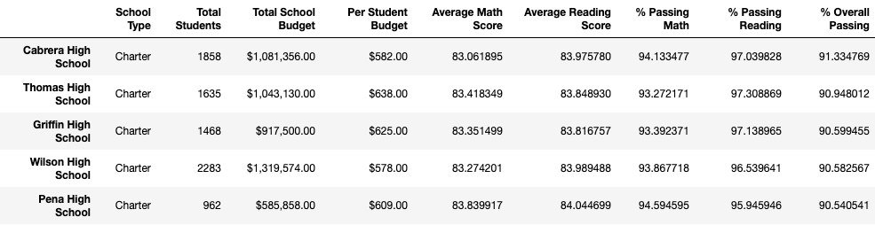
  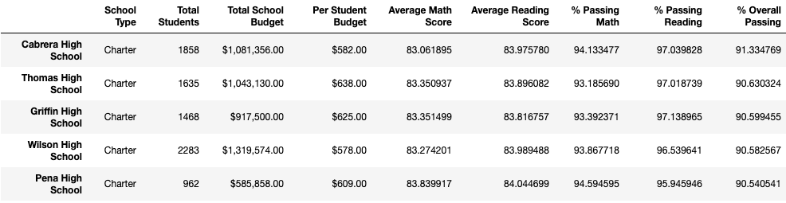

- How does replacing the ninth-grade scores affect the following:
  - Reading scores by grade
    - As shown in the tables below (original analysis on the left, new analysis on the right) the only difference is the `nan` for 9th grade Thomas High School grade.

    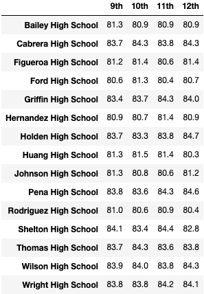
    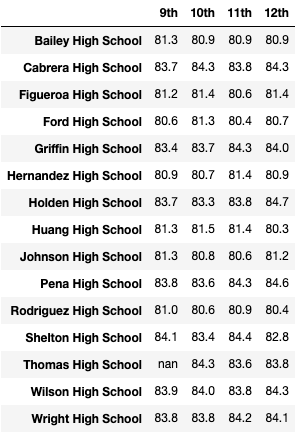

  - Math scores by grade
    - As shown in the tables below (original analysis on the left, new analysis on the right) the only difference is the `nan` for 9th grade Thomas High School grade.

    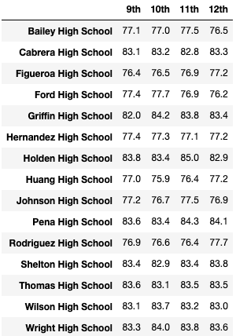
    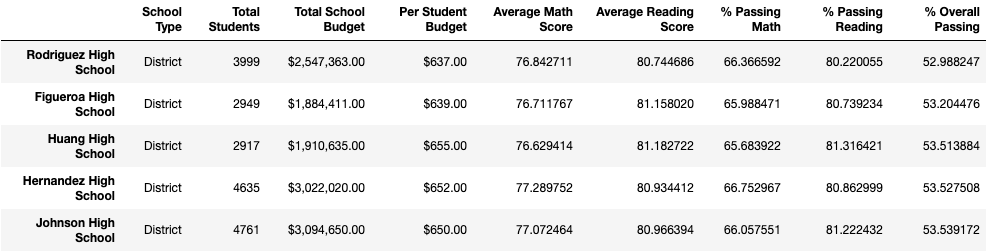

  - Scores by school spending
    - As shown in the tables below (original analysis on the top, new analysis on the bottom) there is no noticeable effect on the scores categorized by different school spending ranges per student

    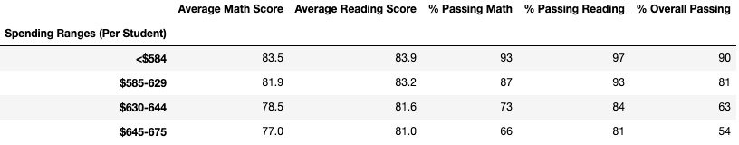
    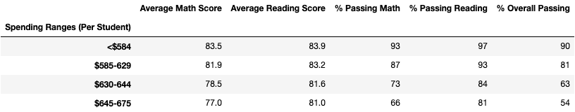

  - Scores by school size
    - As shown in the tables below (original analysis on the top, new analysis on the bottom) there is no noticeable effect on the scores categorized by different school sizes

    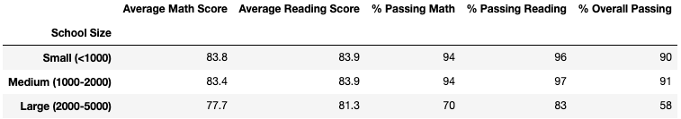
    

  - Scores by school type
    - As shown in the tables below (original analysis on the top, new analysis on the bottom) there is no noticeable effect on the scores categorized by different school types

    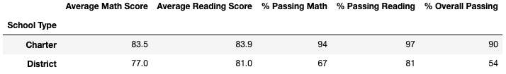
    

## Summary

### Observations

After replacing the Thomas High School ninth graders' reading and math scores with NaNs, we identified 4 changes in the district analysis:
1. The most noticable difference is the fact that we now see a `nan` for Thomas High School 9th grade as opposed to a numerical value when we look at the reading and math scores by grade
2. On the school summary for the Thomas High School DataFrame there was a slight decrease in the "Average Math Score", a slight increase in the "Average Reading Score", and miniscule changes to the "% Passing Math", "% Passing Reading", and "% Overall Passing".
3. A slight change in numerical values did not move Thomas High School from being the second highest ranking high school when comparing by "% Overall Passing".
4. There are very minimal changes to "% Passing Math", "% Passing Reading", and "% Overall Passing" on the  that you would only notice if you round to the thousandth place.

 Our biggest takeaway was that the Thomas High School 9th graders only account for approximately 1.2% of all students in the district which would explain why we did not see significant differences when we weren't evaluating by grade.