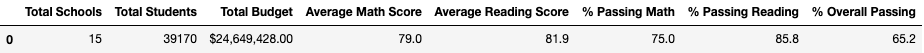
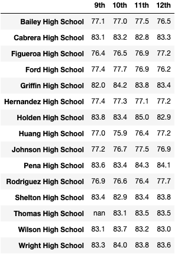
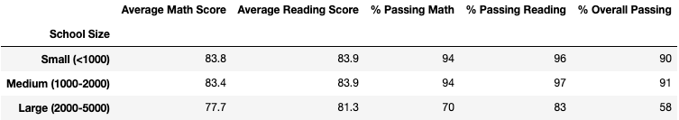

# School District Analysis with Python

## Overview of Project

### Purpose

The school board noticed evidence of academic dishonesty, specifically with the Thomas High School ninth grade reading and math grades. Our objective is to repeat the school district analysis after we replace the Thomas High School ninth grade reading and math grades with NaN values while keeping the rest of the data the same.

### Resources

- Data Source: [schools_complete.csv](Resources/schools_complete.csv), [students_complete.csv](Resources/students_complete.csv)
- Software: Python 3.7.9, pandas 1.1.3, numpy 1.19.2, jupyter-notebook 6.1.4, Visual Studio Code 1.52.1

## Project Results 
<!--
How did you perform your analysis (use images and links to code)
`code`
Relative links to image
-->
### Procedure

### Analysis
<!--
There is a bulleted list that addresses how each of the seven school district metrics was affected by the changes in the data (10 pt).
Results: Using bulleted lists and images of DataFrames as support, address the following questions.''
-->

- How is the district summary affected?
  - The tables displayed below show the district summary for the original district analysis (on the left) and the new district analysis (on the right).
 |

- How is the school summary affected?
  - The tables displayed below show the school summary for the original district analysis (on the left) and the new district analysis (on the right).

 |

- How does replacing the ninth graders’ math and reading scores affect Thomas High School’s performance relative to the other schools?
  - The tables displayed below show the top 5 schools on the original district analysis (on the left) and the new district analysis (on the right). These tables show us that replacing the Thomas High School 9th grade scores with NaN did not affect their performance relative to the other schools.

 |

- How does replacing the ninth-grade scores affect the following:
  - Reading scores by grade

   |
  

  - Math scores by grade

   |
  

  - Scores by school spending

   |
  

  - Scores by school size

   |
  

  - Scores by school type

   |
  

## Summary

### 4 Changes

After replacing the Thomas High School ninth graders' reading and math scores with NaNs, we identified 4 changes in the district analysis:
1. One
2. Two
3. Three
4. Four